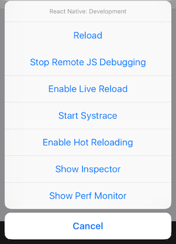
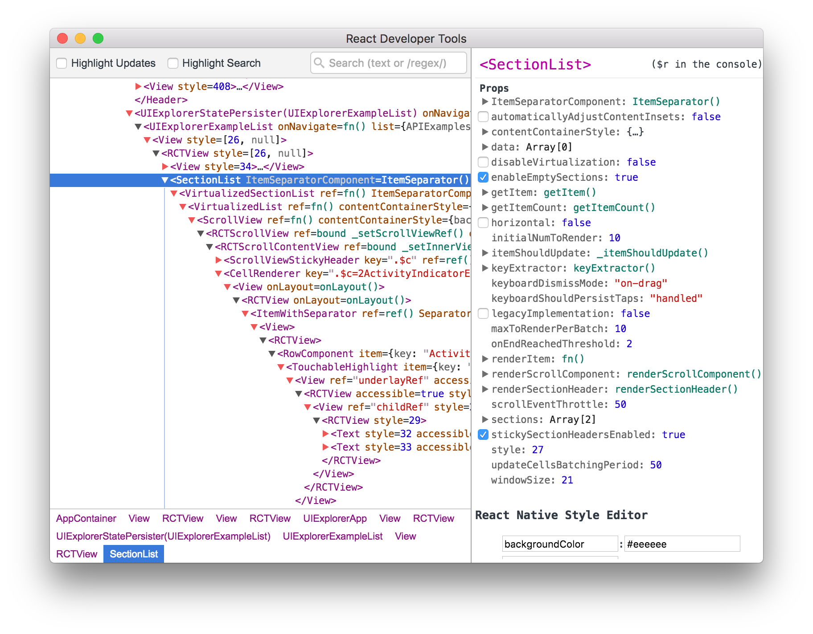

## 开启调试快捷键

React Native 支持多种在ios模拟器上的快捷键，下面将会详细介绍，若要启动它们，打开`Hardware`菜单，选择`Keyboard`选项卡，确保 `Connect Hardware Keyboard` 选项开启。

## 访问APP内的开发菜单

您可以通过摇晃设备或在IOS模拟器的`Hardware`菜单中选择“Shake Gesture”选项来调出开发者菜单，另外，如果是在iOS模拟器中运行，还可以按下`⌘ + D` 快捷键，Android模拟器对应的则是`⌘ + M`。当然，如果是Android,您还可以通过adb工具运行命令`adb shell input keyevent 82`来打开开发者菜单（82是菜单代码）。



> 注：在非开发调试版本（release/production builds）中开发者菜单会被关闭。

## 刷新 JavaScript

在React Native开发中，每次改动后您再也不需要等待漫长的重编译，通过`reloading javascripts(重新加载js)`将可以简单快速的查看界面/功能变化，具体的操作就是在开发菜单中点击"Reload"选项。也可以在iOS模拟器中按下`⌘ + R` ，Android模拟器上对应的则是按两下`R`。

### 自动刷新


You can speed up your development times by having your app reload automatically any time your code changes. Automatic reloading can be enabled by selecting "Enable Live Reload" from the Developer Menu.

You may even go a step further and keep your app running as new versions of your files are injected into the JavaScript bundle automatically by enabling [Hot Reloading](https://facebook.github.io/react-native/blog/2016/03/24/introducing-hot-reloading.html) from the Developer Menu. This will allow you to persist the app's state through reloads.

> There are some instances where hot reloading cannot be implemented perfectly. If you run into any issues, use a full reload to reset your app.

You will need to rebuild your app for changes to take effect in certain situations:

* You have added new resources to your native app's bundle, such as an image in `Images.xcassets` on iOS or the `res/drawable` folder on Android.
* You have modified native code (Objective-C/Swift on iOS or Java/C++ on Android).

## In-app Errors and Warnings

Errors and warnings are displayed inside your app in development builds.

### Errors

In-app errors are displayed in a full screen alert with a red background inside your app. This screen is known as a RedBox. You can use `console.error()` to manually trigger one.

### Warnings

Warnings will be displayed on screen with a yellow background. These alerts are known as YellowBoxes. Click on the alerts to show more information or to dismiss them.

As with a RedBox, you can use `console.warn()` to trigger a YellowBox.

YellowBoxes can be disabled during development by using `console.disableYellowBox = true;`. Specific warnings can be ignored programmatically by setting an array of prefixes that should be ignored:

```javascript
import {YellowBox} from 'react-native';
YellowBox.ignoreWarnings(['Warning: ...']);
```

In CI/Xcode, YellowBoxes can also be disabled by setting the `IS_TESTING` environment variable.

> RedBoxes and YellowBoxes are automatically disabled in release (production) builds.

## Chrome Developer Tools

To debug the JavaScript code in Chrome, select "Debug JS Remotely" from the Developer Menu. This will open a new tab at [http://localhost:8081/debugger-ui](http://localhost:8081/debugger-ui).

Select `Tools → Developer Tools` from the Chrome Menu to open the [Developer Tools](https://developer.chrome.com/devtools). You may also access the DevTools using keyboard shortcuts (`⌘⌥I` on macOS, `Ctrl` `Shift` `I` on Windows). You may also want to enable [Pause On Caught Exceptions](http://stackoverflow.com/questions/2233339/javascript-is-there-a-way-to-get-chrome-to-break-on-all-errors/17324511#17324511) for a better debugging experience.

> Note: the React Developer Tools Chrome extension does not work with React Native, but you can use its standalone version instead. Read [this section](debugging.md#react-developer-tools) to learn how.

### Debugging using a custom JavaScript debugger

To use a custom JavaScript debugger in place of Chrome Developer Tools, set the `REACT_DEBUGGER` environment variable to a command that will start your custom debugger. You can then select "Debug JS Remotely" from the Developer Menu to start debugging.

The debugger will receive a list of all project roots, separated by a space. For example, if you set `REACT_DEBUGGER="node /path/to/launchDebugger.js --port 2345 --type ReactNative"`, then the command `node /path/to/launchDebugger.js --port 2345 --type ReactNative /path/to/reactNative/app` will be used to start your debugger.

> Custom debugger commands executed this way should be short-lived processes, and they shouldn't produce more than 200 kilobytes of output.

## React Developer Tools

You can use [the standalone version of React Developer Tools](https://github.com/facebook/react-devtools/tree/master/packages/react-devtools) to debug the React component hierarchy. To use it, install the `react-devtools` package globally:

```
npm install -g react-devtools
```

Now run `react-devtools` from the terminal to launch the standalone DevTools app:

```
react-devtools
```



It should connect to your simulator within a few seconds.

> Note: if you prefer to avoid global installations, you can add `react-devtools` as a project dependency. Add the `react-devtools` package to your project using `npm install --save-dev react-devtools`, then add `"react-devtools": "react-devtools"` to the `scripts` section in your `package.json`, and then run `npm run react-devtools` from your project folder to open the DevTools.

### Integration with React Native Inspector

Open the in-app developer menu and choose "Show Inspector". It will bring up an overlay that lets you tap on any UI element and see information about it:


However, when `react-devtools` is running, Inspector will enter a special collapsed mode, and instead use the DevTools as primary UI. In this mode, clicking on something in the simulator will bring up the relevant components in the DevTools:


You can choose "Hide Inspector" in the same menu to exit this mode.

### Inspecting Component Instances

When debugging JavaScript in Chrome, you can inspect the props and state of the React components in the browser console.

First, follow the instructions for debugging in Chrome to open the Chrome console.

Make sure that the dropdown in the top left corner of the Chrome console says `debuggerWorker.js`. **This step is essential.**

Then select a React component in React DevTools. There is a search box at the top that helps you find one by name. As soon as you select it, it will be available as `$r` in the Chrome console, letting you inspect its props, state, and instance properties.


## Performance Monitor

You can enable a performance overlay to help you debug performance problems by selecting "Perf Monitor" in the Developer Menu.

<hr style="margin-top:25px; margin-bottom:25px;"/>

# Debugging in Ejected Apps

<div class="banner-crna-ejected" style="margin-top:25px">
  <h3>Projects with Native Code Only</h3>
  <p>
    The remainder of this guide only applies to projects made with <code>react-native init</code>
    or to those made with Create React Native App which have since ejected. For
    more information about ejecting, please see
    the <a href="https://github.com/react-community/create-react-native-app/blob/master/EJECTING.md" target="_blank">guide</a> on
    the Create React Native App repository.
  </p>
</div>

## Accessing console logs

You can display the console logs for an iOS or Android app by using the following commands in a terminal while the app is running:

```
$ react-native log-ios
$ react-native log-android
```

You may also access these through `Debug → Open System Log...` in the iOS Simulator or by running `adb logcat *:S ReactNative:V ReactNativeJS:V` in a terminal while an Android app is running on a device or emulator.

> If you're using Create React Native App, console logs already appear in the same terminal output as the packager.

## Debugging on a device with Chrome Developer Tools

> If you're using Create React Native App, this is configured for you already.

On iOS devices, open the file [`RCTWebSocketExecutor.m`](https://github.com/facebook/react-native/blob/master/Libraries/WebSocket/RCTWebSocketExecutor.m) and change "localhost" to the IP address of your computer, then select "Debug JS Remotely" from the Developer Menu.

On Android 5.0+ devices connected via USB, you can use the [`adb` command line tool](http://developer.android.com/tools/help/adb.html) to setup port forwarding from the device to your computer:

`adb reverse tcp:8081 tcp:8081`

Alternatively, select "Dev Settings" from the Developer Menu, then update the "Debug server host for device" setting to match the IP address of your computer.

> If you run into any issues, it may be possible that one of your Chrome extensions is interacting in unexpected ways with the debugger. Try disabling all of your extensions and re-enabling them one-by-one until you find the problematic extension.

### Debugging with [Stetho](http://facebook.github.io/stetho/) on Android

Follow this guide to enable Stetho for Debug mode:

1. In `android/app/build.gradle`, add these lines in the `dependencies` section:

   ```gradle
    debugCompile 'com.facebook.stetho:stetho:1.5.0'
    debugCompile 'com.facebook.stetho:stetho-okhttp3:1.5.0'
   ```

> The above will configure Stetho v1.5.0. You can check at http://facebook.github.io/stetho/ if a newer version is available.

2. Create the following Java classes to wrap the Stetho call, one for release and one for debug:

   ```java
   // android/app/src/release/java/com/{yourAppName}/StethoWrapper.java

   public class StethoWrapper {

       public static void initialize(Context context) {
           // NO_OP
       }

       public static void addInterceptor() {
           // NO_OP
       }
   }
   ```

   ```java
   // android/app/src/debug/java/com/{yourAppName}/StethoWrapper.java

   public class StethoWrapper {
       public static void initialize(Context context) {
         Stetho.initializeWithDefaults(context);
       }

       public static void addInterceptor() {
         OkHttpClient client = OkHttpClientProvider.getOkHttpClient()
                .newBuilder()
                .addNetworkInterceptor(new StethoInterceptor())
                .build();

         OkHttpClientProvider.replaceOkHttpClient(client);
       }
   }
   ```

3. Open `android/app/src/main/java/com/{yourAppName}/MainApplication.java` and replace the original `onCreate` function:

```java
  public void onCreate() {
      super.onCreate();

      if (BuildConfig.DEBUG) {
          StethoWrapper.initialize(this);
          StethoWrapper.addInterceptor();
      }

      SoLoader.init(this, /* native exopackage */ false);
    }
```

4. Open the project in Android Studio and resolve any dependency issues. The IDE should guide you through this steps after hovering your pointer over the red lines.

5. Run `react-native run-android`.

6. In a new Chrome tab, open: `chrome://inspect`, then click on the 'Inspect device' item next to "Powered by Stetho".

## Debugging native code

When working with native code, such as when writing native modules, you can launch the app from Android Studio or Xcode and take advantage of the native debugging features (setting up breakpoints, etc.) as you would in case of building a standard native app.
